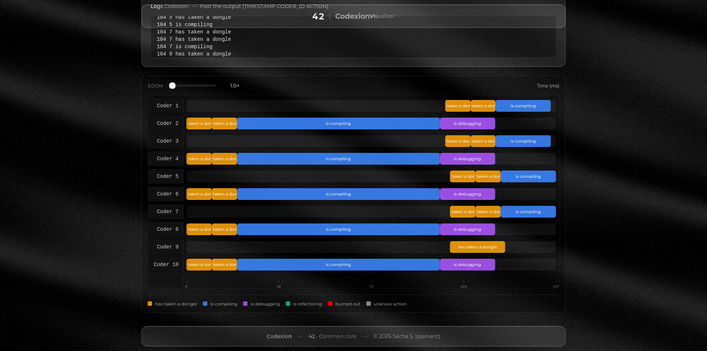

# Codexion - Visualizer

Codexion data visualization tool (TypeScript)

## Authors

- [@0xS4cha](https://github.com/0xS4cha)
- [@69Nesta](https://github.com/69Nesta)

## Result

https://codexion-visualizer.sacha-dev.me/


## Description

This project is a TypeScript project focused on visualizing and exploring Codexion data through a clear, interactive interface. It has been created as part of the 42 curriculum (Codexion - Visualizer - 42 CC) to help inspect structures, debug datasets, and present information in a more readable and navigable format.


## Instruction

The Codexion Visualizer can be run locally with a standard Node.js toolchain.

```bash
npm install
```

Then run it:

```bash
npm run dev
```

## Usage

### Local Development

```bash
npm run dev
```

### Build

```bash
npm run build
```

### Preview (if available)

```bash
npm run preview
```

### Data Input

Depending on the project configuration, you can typically:
- load a local Codexion file (drag & drop or file picker),
- paste raw JSON/text in a panel,
- or point the app to a data endpoint.

> If your repo expects a specific input format (file name, schema, folder), document it here.

## Visualization

The visualization layer is designed to provide:
- **Readable structure** (graph/tree/timeline depending on the dataset)
- **Interactive navigation** (zoom, pan, selection)
- **Search & filtering** to focus on relevant elements
- **Debug-friendly inspection** (metadata panels, IDs, relations)


## Feedback

If you have feedback, open an issue or contact the author.
